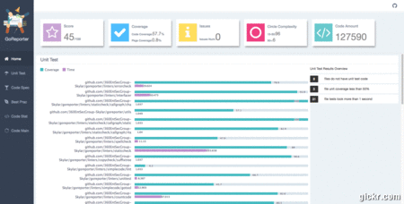

# goreporter [](https://github.com/360EntSecGroup-Skylar/goreporter/releases/tag/version3.0)

[](https://github.com/360EntSecGroup-Skylar/goreporter/releases/latest)
[](https://travis-ci.org/360EntSecGroup-Skylar/goreporter)
[](https://godoc.org/github.com/360EntSecGroup-Skylar/goreporter)
[](http://www.apache.org/licenses/LICENSE-2.0.html)

A Golang tool that does static analysis, unit testing, code review and generate code quality report. This is a tool that concurrently runs a whole bunch of those linters and normalizes their output to a report:

<!-- MarkdownTOC -->

- [Supported linters](#supported-linters)
- [Supported template](#supported-template)
- [Todo List](#todo-list)
- [Installing](#installing)
  - [Requirements](#requirements)
- [Run it](#run-it)
- [Quickstart](#quickstart)
- [Example](#example)
- [Report-example](#report-example)
- [Credits](#credits)

<!-- /MarkdownTOC -->

## Supported linters

- [gofmt](https://golang.org/cmd/gofmt) - Checks if the code is properly formatted and could not be further simplified.
- [govet](https://golang.org/cmd/vet/#hdr-Shadowed_variables) - Reports variables that may have been unintentionally shadowed.
- [golint](https://github.com/golang/lint) - Golint is a linter for Go source code.
- [unittest](https://github.com/360EntSecGroup-Skylar/goreporter/tree/master/linters/unittest) - Golang unit test status.
- [deadcode](https://github.com/tsenart/deadcode) - Finds unused code.
- [gocyclo](https://github.com/alecthomas/gocyclo) - Computes the cyclomatic complexity of functions.
- [varcheck](https://github.com/opennota/check) - Find unused global variables and constants.
- [structcheck](https://github.com/opennota/check) - Find unused struct fields.
- [aligncheck](https://github.com/opennota/check) - Warn about un-optimally aligned structures.
- [errcheck](https://github.com/kisielk/errcheck) - Check that error return values are used.
- ~~[copycode(dupl)](https://github.com/mibk/dupl) - Reports potentially duplicated code.~~
- [gosimple](https://github.com/dominikh/go-tools/tree/master/cmd/gosimple) - Report simplifications in code.
- [staticcheck](https://github.com/dominikh/go-tools/tree/master/cmd/staticcheck) - Statically detect bugs, both obvious and subtle ones.
- [godepgraph](https://github.com/kisielk/godepgraph) - Godepgraph is a program for generating a dependency graph of Go packages.
- [misspell](https://github.com/client9/misspell) - Correct commonly misspelled English words... quickly.
- [countcode](https://github.com/bytbox/sloc) - Count lines and files of project.
- [interfacer](https://github.com/mvdan/interfacer) - Suggest narrower interfaces that can be used.
- [depth](https://github.com/360EntSecGroup-Skylar/goreporter/tree/feature-3.0/linters/depth) - Count the maxdepth of go functions.
- [flen](https://github.com/lafolle/flen) - Flen provides stats on functions/methods lengths in a Golang package.

## Template

- html template file which can be loaded via `-t <file>`.

## Todo List

- This version will re-design the template.
- Add interfacer and safesql and gofmt(-s),govet linter.

## Installing

### Requirements

- [Go](https://golang.org/dl/) 1.6+
- [Graphviz](http://www.graphviz.org/download/)

## Quickstart

Install goreporter (see above).

```bash
go get -u github.com/360EntSecGroup-Skylar/goreporter
```

## Run it:

### NOTE

You have to confirm that your project is operational. In particular, the problem with vendor, when the package is not found in the default path, goreporter will look again from the possible vendor path.

```bash
goreporter -p [projectRelativePath] -r [reportPath] -e [exceptPackagesName] -f [json/html/text]  {-t templatePathIfHtml}
```

- -version Version of GoReporter.
- -p Must be a valid Golang project path.
- -r Save the path to the report.
- -e Exceptional packages (multiple separated by commas, for example: "linters/aligncheck,linters/cyclo" ).
- -f report format json, html OR text.
- -t Template path,if not specified, the default template will be used.

By default, the default template is used to generate reports in html format.

## Example



you can see result detail:[online-example-report](http://wgliang.github.io/pages/goreporter-report.html)

## Credits

Logo is designed by [Ri Xu](https://github.com/xuri)
